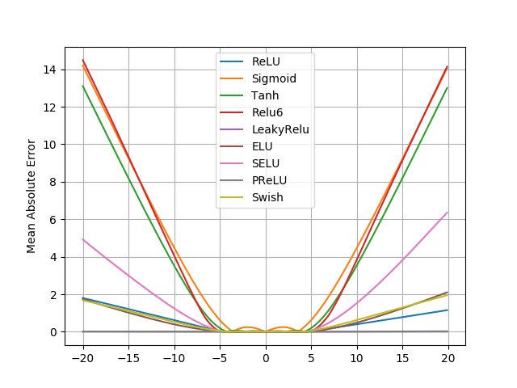

# NALU
An implementation of Neural Arithmetic Logic Units (https://arxiv.org/pdf/1808.00508.pdf)

## Notes

### Differences between this implementation and the original one in the paper
* Use two separate weight matrices for the adder and the multiplier
* The gate is independent of the input

See [nalu.py](nalu.py) for more details. I found these modifications can help the performance on the static simple function learning task.

## Exp 1: Fail to Extrapolate
Train an identity mapping on [-5, 5] and test it on [-20, 20]

```bash
python3 failure.py
```

#### Results

* Most non linear activation functions fail to exprapolate except that PReLU can learn to be highly linear.



## Exp 2: Static Simple Function Learning
Input a 100-dimensional vertex **x**, learn `y = func(a, b)`,
where 
,   and `func = +, -, x, /, ...`. Test the ability to interpolate and extrapolate.

```bash
python3 learn_function.py
```

### Interpolation
* RMSE (normalized to a random baseline)

|     |ReLU|NALU|NAC|Sigmoid|
| --- |  --- | --- | --- | --- |
|a + b|0.00|0.01|0.00|0.11|
|a - b|0.16|0.12|0.00|0.85|
|a x b|1.86|0.00|13.42|1.21|
|a / b|0.88|0.01|1.89|0.12|
|a ^ 2|3.56|0.00|20.56|0.32|
|sqrt(a)|0.60|0.02|2.56|0.14|

### Extrapolation
* RMSE (normalized to a random baseline)

|     |ReLU|NALU|NAC|Sigmoid|
| --- |  --- | --- | --- | --- |
|a + b|0.00|0.42|0.00|62.55|
|a - b|59.23|0.43|0.00|60.64|
|a x b|57.13|0.00|75.73|88.27|
|a / b|3.07|0.36|23.82|1.32|
|a ^ 2|57.99|0.00|76.48|81.51|
|sqrt(a)|16.58|0.17|63.17|18.08|

